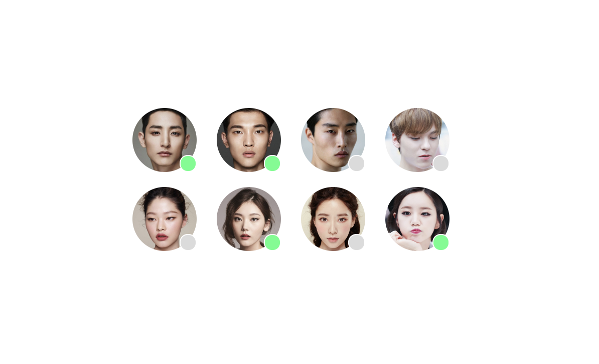

### 5월 3일 과제 설명

## 1. 과제 요구 사항

> ### 1.1 다음과 같은 요구사항을 충족 해야한다.
>
> - 아바타 이미지는 배경 방식이 아닌 콘텐츠 이미지 요소로 마크업한다.
> - 아바타의 상태 정보를 알 수 있도록 정보를 제공한다. (이미지 하단 오른쪽에 동그라미를 나타내고 배경 색으로 상태 정보를 볼 수 있도록 한다.)
> - 아바타 이미지의 크기 - 64px X 64px
> - 아바타 이미지 간의 간격 - 20px
> - 회색 원 배경색 - #DBDBDB
> - 초록색 원 배경색- #4CFE88
> - float을 사용하여 레이아웃을 구현한다.
> - flex를 지원하는 환경에서는 flex로 레이아웃을 구현해 본다. 또한, 여자와 남자의 행의 위치를 반전시킨다.

## 2. 과제 예상 결과물

> ### 2.1 float를 사용하여 정렬한 예상 결과
>
> </img>
>
> ### 2.2 flex를 사용하여 정렬한 예상 결과
>
> </img>

## 3. 과제 수행 내용

> ### 3.1 마크업 구조 설계
>
> ```html
> <div class="avatars-wrapper">
>   <div class="avatar1 avatars">
>     
>     <span class="circle" aria-label="오프라인"></span>
>   </div>
>   . . .
> </div>
> ```
>
> 💡 위의 코드와 같이 총 8개의 아바타를 감싸는 avatars-wrapper가 최상위 부모로 설계 하였고, 각 아바타는 이미지와, 상태 정보를 알려주기 위한 요소가 필요하기에 wrapper 하위에 avatars를 만들어 하위에 img, span 태그로 설계 하였습니다. 또한, 접근성을 위해 이미지에 대체 텍스트로 여자1~남자4까지 지정을 해뒀고 상태에 따라 동그라미에 온라인, 오프라인 라벨을 지정 해뒀습니다.
>
> 
>
> ### 3.2 아바타 이미지, 상태 정보 디자인
>
> ```css
> .avatars-wrapper {
>   padding: 250px 545px;
> }
>
> .avatars {
>   position: relative;
>   margin: 5px 0; /* 이 부분은 최상위 부모가 기본 height가 5가 잡혀 있어서 아바타 간 위 아래 간격을 20px을 맞추기 위해서 5px를 아래 위로 값을 주어 위아래 간격을 20px을 맞추기 위해 사용하였습니다.*/
> }
>
> .avatars img {
>   width: 64px;
>   height: 64px;
>   border-radius: 32px;
> }
>
> .avatars .circle {
>   position: absolute;
>   bottom: 5px;
>   right: 0px;
>   width: 15px;
>   height: 15px;
>   border-radius: 8px;
>   border: 1px solid white;
>   background-color: #4cfe88;
> }
> .avatars:nth-child(1) .circle,
> .avatars:nth-child(3) .circle,
> .avatars:nth-child(7) .circle,
> .avatars:nth-child(8) .circle {
>   background-color: #dbdbdb;
> }
> ```
>
> 💡 아바타들을 중앙에 위치 하기 위해 임의로 패딩값을 최상위 부모에 지정 하였고, avatars position을 relative로 지정하였는데 동그라미 부분을 absolute로 사용하기 위해 지정하였습니다. 아바타들의 이미지는 요구사항에 맞게 64x64 크기를 지정하였고 그 크기의 반값인 radius값을 주어 원형으로 만들었습니다. 또, circle 부분은 포지션을 absolute를 이용하여 이미지 하단 오른쪽에 위치하도록 bottom, right를 이용하여 위치를 지정 시켰고 기본색은 #4cfe88로 설정해두고 오프라인인 아바타만 nth-child()를 이용하여 #dbdbdb로 색을 변경해서 상태 정보를 나타내도록 하였습니다.
>
> 
>
> ### 3.3 float 레이아웃 정렬
>
> ```css
> .avatars:nth-child(n + 1):nth-child(-n + 4) {
>   float: left;
> }
> .avatars:nth-child(n + 2):nth-child(-n + 4) {
>   margin-left: 20px;
> }
>
> /* clear: both => 다음 행으로 넘기기 위해서 사용 5번째에만 적용을 하면 공간이 생기고 그곳에 6~8번까지 float로 left 정렬을 시킴 */
> .avatars:nth-child(5) {
>   clear: both;
>   float: left;
> }
>
> .avatars:nth-child(n + 6):nth-child(-n + 8) {
>   float: left;
>   margin-left: 20px;
> }
> ```
>
> 💡 avatars를 마크업 순서대로 여자1~여자4,남자1~남자4로 설계를 해두었고 nth-child()를 이용하여 여자 1~4 까지 float를 주었고, 2번째 아바타 부터 왼쪽 마진을 주어 20px 만큼의 아바타들의 간격이 되도록 하였습니다. 그리고 행으로 넘기기 위해서 clear: both를 남자1에게 준뒤 float 시키고 나머지 남자들을 그 공간에 float 시켜서 아래와 같은 결과가 나오도록 하였습니다.
>
> ### 3.4 float 레이아웃 정렬
>
> ```css
> @supports (display: flex) {
>   .avatars-wrapper {
>     display: flex;
>     flex-flow: wrap-reverse;
>   }
> }
> ```
>
> 💡 @supports 조건부 규칙을 이용하여 flex를 지원하는 경우이면 아바타들을 감싸고 있는 부모를 flex로 지정시킨 뒤 wrap-reverse 속성을 사용하여 다음 행으로 넘어가면서 여자와 남자들이 반전되도록 하였습니다.

## 4. 과제 수행 결과

> ### 4.1 float를 사용하여 정렬한 결과
>
> </img>
>
> ### 4.2 flex를 사용하여 정렬한 결과
>
> </img>

## 5. 느낀점

> 보통 레이아웃 관련 정렬 속성은 flex, grid, position을 많이 사용 했었는데 float라는 속성을 알게되서 공부 할 수 있어서 좋았고, css 조건부 규칙 이나 가상선택자 nth-child() 등을 알고 많이 사용 할 수 있겠다 라고 느꼈습니다.
